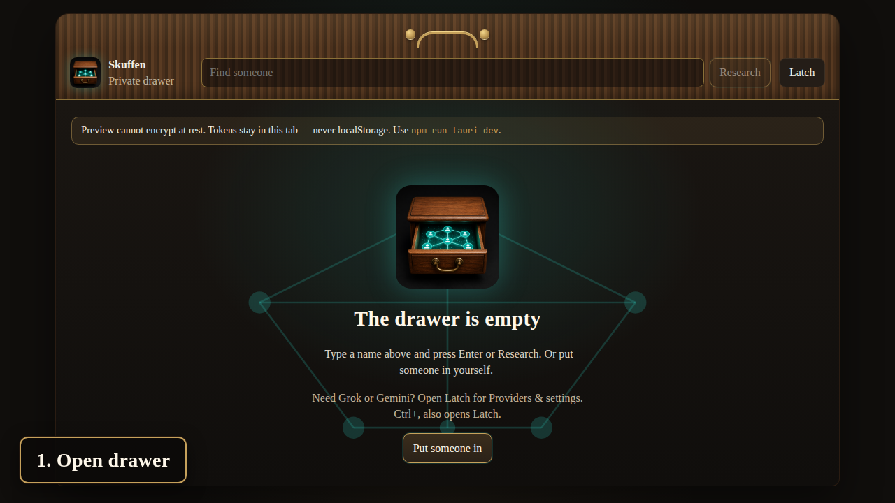
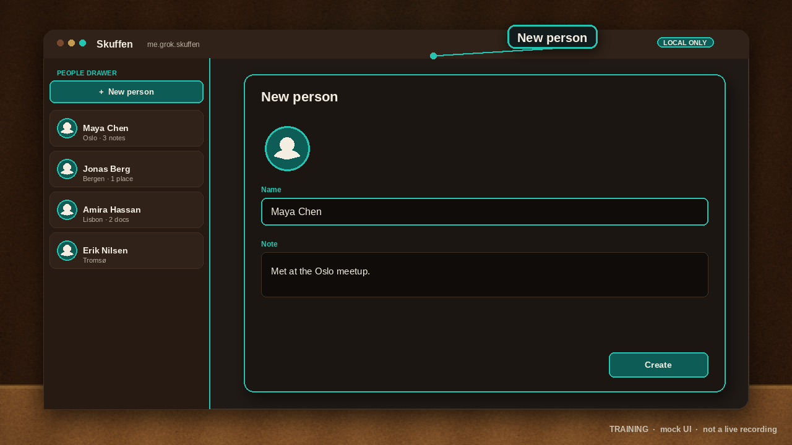
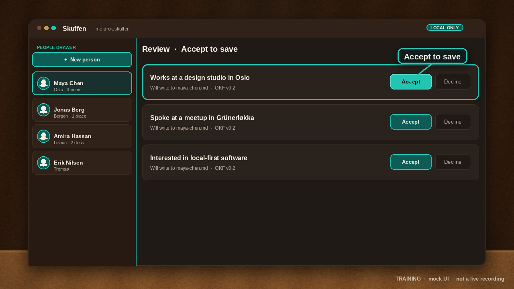

# Skuffen

Agentic AI Driven Personal Intelligence

Skuffen is **local-only** personal intelligence software. You keep a private people-graph on your own machine: contacts, notes, social links, photos, and documents. There is no Skuffen account, no analytics, and no cloud backend for people data.

The people-graph is stored as an [Open Knowledge Format v0.2](https://github.com/GoogleCloudPlatform/knowledge-catalog/blob/main/okf/SPEC.md) bundle. File path is identity. On desktop, tokens for Grok and Gemini live in the OS credential store. They never enter the OKF bundle.

Homepage (later): [https://skuffen.grok.me](https://skuffen.grok.me)

Sole developer: Sondre Bjellås ([sondreb](https://github.com/sondreb)).

## Screenshots

Real Angular web preview (`npm start`) at 1280×720. Synthetic **Ada Demo** data. Grok and Gemini are mocked — no live API keys.



*Hero still. Real browser UI. Synthetic demo data. AI providers mocked.*



*Add a person. Real browser UI. Synthetic demo data. AI providers mocked.*



*Grok research, you accept. Real browser UI. Synthetic demo data. AI providers mocked. Nothing is written until you accept.*

## Demos

Short walkthroughs of the same real web preview. On-screen labels. Real browser UI, synthetic demo data, AI providers mocked. Click a still to play the clip.

<video src="https://github.com/sondreb/skuffen/releases/download/docs-media/01-what-is-skuffen.mp4" controls>
  <a href="https://github.com/sondreb/skuffen/blob/main/docs/media/01-what-is-skuffen.mp4">What is Skuffen</a>
</video>

[](https://github.com/sondreb/skuffen/blob/main/docs/media/01-what-is-skuffen.mp4)

*What is Skuffen. Real browser UI. Synthetic demo data. AI providers mocked.*

<video src="https://github.com/sondreb/skuffen/releases/download/docs-media/02-add-person-and-place.mp4" controls>
  <a href="https://github.com/sondreb/skuffen/blob/main/docs/media/02-add-person-and-place.mp4">Add a person and a place</a>
</video>

[](https://github.com/sondreb/skuffen/blob/main/docs/media/02-add-person-and-place.mp4)

*Add a person and a place. Real browser UI. Synthetic demo data. AI providers mocked.*

<video src="https://github.com/sondreb/skuffen/releases/download/docs-media/03-grok-research-you-accept.mp4" controls>
  <a href="https://github.com/sondreb/skuffen/blob/main/docs/media/03-grok-research-you-accept.mp4">Grok research, you accept</a>
</video>

[](https://github.com/sondreb/skuffen/blob/main/docs/media/03-grok-research-you-accept.mp4)

*Grok research, you accept. Real browser UI. Synthetic demo data. AI providers mocked.*

## Stack

- Desktop: [Tauri](https://tauri.app) 2 (latest stable), app identifier `me.grok.skuffen`
- UI: [Angular](https://angular.dev) 22 standalone components, TypeScript
- Rust only in the Tauri shell (filesystem, OS keyring, Grok OAuth device flow)
- Gemini via [`@google/genai`](https://github.com/googleapis/js-genai) — Grok is never routed through that SDK
- Package manager: **npm** (`packageManager` in `package.json`)

## Develop

```bash
npm install
npm run tauri dev
```

Node.js 22.22.3+ is required for Angular 22. On Linux, install Tauri's GTK/WebKit packages (`libwebkit2gtk-4.1-dev`, `libgtk-3-dev`, `librsvg2-dev`). Rust 1.98+ is pinned in `rust-toolchain.toml`.

Frontend only (browser preview, localStorage stand-in for the people-graph bundle):

```bash
npm start
```

The browser preview keeps the people-graph in a localStorage stand-in (plaintext). Use `npm run tauri dev` for the on-disk OKF folder. Grok/Gemini API keys and OAuth tokens still stay in memory for the current tab only. They are never written to `localStorage`, `sessionStorage`, or any other durable browser storage, and they vanish on reload.

OKF / vault / MCP / browser-secret / OAuth / research-follow / merge-proposal / brief / capture / shuffle / timeline / commitments / update-check checks:

```bash
npm run test:okf
npm run test:vault
npm run test:mcp
npm run test:secrets
npm run test:oauth
npm run test:research
npm run test:self
npm run test:theme
npm run test:people-pane
npm run test:people-sort
npm run test:merge
npm run test:brief
npm run test:capture
npm run test:shuffle
npm run test:timeline
npm run test:commitments
npm run test:relations
npm run test:places
npm run test:update
npm run test:version
npm run test:e2e
```

Labeled README stills and MP4s (mocked providers, `?demo=1`):

```bash
npm run demo:record
```

Pull-request CI (`.github/workflows/ci.yml`) runs those checks plus `npm run build` on Node 22.22.3. It does **not** build the Tauri desktop app.

## Draft desktop release

Unsigned Windows, Linux, and macOS installers are built by **Draft desktop release** (`.github/workflows/release.yml`), not by PR CI. Every merge to `main` bumps the patch version in lockstep and opens a new **draft** GitHub Release. `workflow_dispatch` is optional. The GitHub Release is always `draft: true`. Sondre tests an installer, then publishes. There is no iOS/Android job, no notarization, and no SmartScreen/Play/App Store signing.

- Merge to `main`: always bump **patch**, commit `chore: bump version to X.Y.Z` as github-actions[bot], build from that SHA. The bump push itself is skipped (no second matrix).
- Optional: Actions → Draft desktop release → Run workflow. Version input default is **patch**. Or pass `0.1.1` / `minor` / `major`.
- Tag `v*` is skip-safe for tauri-action.

The workflow keeps versions in lockstep: `package.json`, `src-tauri/tauri.conf.json`, `src-tauri/Cargo.toml`. App identifier stays `me.grok.skuffen`. Installers only — never people-graph data, tokens, or OKF fixtures.

Windows ships NSIS only (no WiX MSI): per-user one-click overwrite in the same folder, no language / directory / start-menu / reinstall radios. Double-click and `/UPDATE` overwrite without running the uninstaller. A leftover MSI is uninstalled once, then NSIS owns the install. macOS replaces the `.app`. Linux uses the existing `.deb` / `.AppImage` targets. The people-graph stays in app data (`me.grok.skuffen`), not next to the exe.

**Check for update** (Menu) looks at the latest **published** GitHub Release for `sondreb/skuffen`. Drafts are invisible to the public API — Sondre still publishes drafts himself. The browser preview (`npm start`) cannot install updates. No GitHub token and no signing private key live in the app or the repo. Nothing from the people-graph is uploaded.

## Storage (OKF v0.2)

Default bundle: the app data directory `people-graph` folder, or a folder you choose.

```
index.md                 # okf_version: "0.2"
log.md
people/
  <slug>/person.md       # type: Person; optional image: local photo path
  <slug>/notes/*.md      # type: Note
  <slug>/social/*.md     # type: SocialProfile
  <slug>/photos/<file>   # photo bytes (profile + gallery)
  <slug>/photos/<file>.md # type: Photo, resource points at the file
  <slug>/place.md        # type: Place (person pin; fallback when no Place link)
  <slug>/relations.md    # type: Relations; typed links to other person.md paths
  <slug>/place-links.md  # type: PlaceLinks; lives / works / met-at → places/{slug}/place.md
places/
  <slug>/place.md        # type: Place; name, optional lat/lng, notes. Path is identity
  <slug>/notes/*.md      # type: Note
  <slug>/files/<file>    # file bytes beside the Place
  <slug>/files/<file>.md # type: File, resource points at the file
documents/
  <slug>/<file>          # file bytes (PDF, images, other docs)
  <slug>/document.md     # type: Document; kind: document; required title + resource
```

Photos and documents are files, not markdown blobs. A Person may set `image` to a local bundle path under that person's folder — the people list uses those bytes only and never fetches `http(s)`. Extra photos live beside the person as Photo concepts. A Document has required `type`, `title`, and `resource` pointing at the file (`kind: document`). File path is identity. `subjects` link one or more people. Drop a file onto a person or use Add file — nothing is uploaded.

A first-class Place lives at `places/<slug>/place.md` — file path is identity. Name, optional lat/lng, notes, and files sit in that folder. People link to a Place as **lives**, **works**, or **met-at** (`people/<slug>/place-links.md`). Documents can list a Place path in `subjects`. There is no land-plot kind.

A person may still keep a leftover pin at `people/<slug>/place.md`. The map prefers first-class Place pins when those exist; people without a Place still show from that location field.

Typed relations live in `people/<slug>/relations.md` next to the person — file path is identity. Adding “Ada is Bea’s sibling” writes both cards. Deleting a person wipes that slug’s edges. Suggested facts from Grok or Gemini are written only after you accept them. On desktop, those files are plaintext markdown+YAML (photos and documents stay as their own files).

## People tags

Each person can have local tags on `people/<slug>/person.md` — file path is identity. Type a tag on the card, Enter or comma to add a chip, click × to remove. Existing tags are suggested as you type. The left-pane filter treats `#family` (or `# family`) as a tag token; leftover text still matches names. `#tag` tokens can mix with name text. Tags stay readable on the expanded people list. The collapsed photo-strip does not show them.

Tags are user writes. The model may only *propose* a tag — Accept writes, uncheck or Reject writes nothing. There is no scoring or friend-heat.

```bash
npm run test:tags
```

## People-graph relations

On a person card you can add or remove a typed link to another local person: **family** (partner, parent, child, sibling, or a free-text family role), **business** (colleague, manager, client, or free-text), **other** (friend, neighbor, or free-text). The people list can filter by kind.

Edges stay in the local OKF bundle. The model may only *propose* a relation — Accept writes, uncheck or Reject writes nothing. There is no people-graph upload. Tokens stay in the OS credential store `me.grok.skuffen`.

```bash
npm run test:relations
```

## Places

Menu → **Places** lists first-class Places on this machine. Empty Places is a local empty state — Skuffen does not fetch places from the network. Add a Place (name, optional pin, notes). Link a person as lives / works / met-at. The model may only *propose* a Place — Accept writes, uncheck or Reject writes nothing.

```bash
npm run test:places
```

## People map

Menu → **Map** prefers first-class Place pins when Places exist. People without a Place can still appear from `people/<slug>/place.md`. Typed relation lines (family / business / other) overlay people who both appear. Click a Place pin to open that Place; click a person pin to open that card. The map fills the content area, including a collapsed photo-strip sidebar.

Search an address or drop a pin from the person card or when creating a Place. **Pins, people, Places, and edges stay on disk** in the OKF bundle. They are never sent to a Skuffen cloud backend (there is none). Map tiles and Nominatim geocoding may use the public internet (OpenStreetMap). The graph is never uploaded to a map provider. No analytics. No friend-heat or ranking.

If nobody has a location and no Place has coordinates, the map is a local empty state. Skuffen does not fetch people from the network.

```bash
npm run test:map
```

## Who knows who

Menu → **Graph** is a full-content-area view of local people as nodes and typed edges as links (family / business / other, plus knows / introduced-by when those labels exist). It is not the geographic map. Click a node to open that person. Pan and zoom. Works with the collapsed photo-strip sidebar.

Edges are typed, never scored. No friend-heat. No ranking. No closeness score. **People and edges stay on disk** in the OKF bundle (`people/<slug>/person.md` and `relations.md`). File path is identity. There is no people-graph upload and no Skuffen graph backend.

If nobody is in the local graph, this view is a local empty state. Skuffen does not fetch people from the network.

```bash
npm run test:graph
```

## People gallery

Menu → **People** is a full-content-area view of everyone as large profile thumbs (local OKF `data:` / `blob:` bytes, initials if there is no photo). Little metadata on the tiles — a quiet name caption, no relations or fields. Two layouts: large thumbs and a denser mosaic. Switching modes and filtering animate the set (fade / scale / layout), including when `#tag` tokens match tags from the people-tag model.

Filter is name text, plus `#tag` once tags exist on the person. Example: `#family` leaves everyone else. Click a thumb to open that card. Works with the collapsed photo-strip sidebar.

**People stay on this machine.** There is no Skuffen people backend and no people-graph upload. Photos are never loaded over `http(s)` for this view. No scoring, ranking, or friend-heat. An empty graph is a local empty state — Skuffen does not fetch people from the network.

```bash
npm run test:gallery
```

## On-disk format

Desktop Skuffen (`npm run tauri dev` or an installer) stores the people-graph as **plaintext markdown+YAML**. File path is identity. Photos and documents are ordinary files beside their concept markdown.

Older builds wrote AES-256-GCM ciphertext in place (`SKUF1` header). If a leftover ciphertext file is still on disk, Skuffen tries to decrypt it once with the wrapping key from the OS credential store (service `me.grok.skuffen`, account `okf-master-key`) and rewrite it as plaintext. If that key is missing or wrong, the file is left unchanged and the UI shows a clear error.

**Where tokens live.** Grok and Gemini tokens stay in the OS credential store:

- Service: `me.grok.skuffen`
- macOS Keychain, Windows Credential Manager, Linux Secret Service
- If no OS keychain is available, the same 0600 file fallback (`<app-data>/credentials/<name>.secret`)

There is no Skuffen password, no Skuffen account, and no cloud KMS. Tokens never enter the OKF bundle or `localStorage`. The people-graph is never uploaded.

**Browser `npm start`.** The preview keeps the graph in a localStorage stand-in (plaintext) and tells you to use the desktop app for the on-disk folder. Tokens still never land in `localStorage`.

**Export OKF.** Export (Menu → Export plaintext OKF) copies the on-disk folder. The browser preview downloads a JSON map of its localStorage stand-in.

**MCP.** Point `SKUFFEN_BUNDLE` at the live people-graph folder. Leftover ciphertext needs `SKUFFEN_OKF_KEY` (the base64 leftover wrapping key) so MCP can decrypt-then-rewrite once. Never upload that key.

## Providers

- **Grok**: RFC 8628 device authorization at `https://auth.x.ai` (public Grok CLI client, OS keychain `me.grok.skuffen` / `grok_oauth`) plus an API-key fallback for `console.x.ai` developer keys. Calls `https://api.x.ai/v1`. The access token is never shown in the UI.
- **Gemini**: API key + `@google/genai`.
- If both are connected, pick one in the UI. Default is Grok.
- Prompts include only the person you asked about, or this one capture — never the full graph.

## Research and Follow

From a person, **Research with Grok** (or Gemini if you chose it) searches public web info. Results are suggestions. Nothing is written to the OKF bundle until you **Accept** — same gate as v1 Ask.

**Follow** is a local scheduler in the desktop app. Pick a per-person interval (daily, weekly, monthly). While Skuffen is open it re-runs that person’s public search and proposes new facts. It never auto-writes, never auto-sends messages, and never uploads the people-graph. The prompt includes only that person.

Follow schedules and pending proposals live in local app settings, not in the OKF bundle. Menu → **Memory** lists that inspectable store: research suggestions, follow schedules, pending facts, and a deletable log of what the model was told. Public web is treated as hostile until you Accept. Nothing durable is written to the OKF bundle without Accept. Tokens stay in the OS credential store — never `localStorage`, never OKF.

```bash
npm run test:research
```

## Pre-meeting brief

From a person card or Menu → **Pre-meeting brief**, Skuffen assembles who, last notes, open follow-ups, place, social, and talking points from what is already on disk. Paste an upcoming event if you want. No Gmail sync. No people-graph upload.

The local brief works offline from the OKF card. Optional Grok/Gemini polish rewrites talking points only — it never auto-sends, and it is never required. Browser preview (`?demo=1`) mocks polish. **Accept** saves the brief as a note. Dismiss writes nothing.

```bash
npm run test:brief
```

## Voice capture

From the people UI, Menu, or the empty list, **Capture** takes a pasted note (browser preview) or a desktop WebView mic transcript. Grok or Gemini — whichever is connected — proposes people, dates, and follow-ups from **that capture only**. The prompt never includes the people-graph.

`?demo=1` mocks the proposal with no mic and no live API keys. Review like research: check or uncheck, then **Accept** writes to the OKF bundle. **Dismiss** writes nothing. Audio bytes are dropped and are never stored. The transcript is written only if you Accept that note. Tokens stay in the OS credential store `me.grok.skuffen`. Never auto-send. Never auto-write.

```bash
npm run test:capture
```

## Reconnect Shuffle

Menu → **Reconnect Shuffle** (or Shuffle on the people list) suggests up to two people a day from last notes, last accept, follow schedule, and recency **already on that card**. There is no cloud scoring of who matters, and no friend-ranker. The people-graph is not uploaded.

You pick one suggestion. An optional reconnect draft is assembled on this machine from that card only. Optional Grok/Gemini polish rewrites the draft for the picked person — never sibling cards. **Never auto-send.** Never auto-DM, never auto-email, never auto-post. **Accept** saves the draft as a note. Skip and Dismiss write nothing.

`?demo=1` can show two synthetic reconnect suggestions (`Ada Demo` / `Bea Demo`) without live keys. Tokens stay in the OS credential store `me.grok.skuffen`. Never `localStorage`. Never OKF.

```bash
npm run test:shuffle
```

## Person-card timeline

The person card has a **Timeline**: one chronological tape of what already exists locally for that person — notes (including accepted briefs, capture notes, and shuffle drafts saved as notes), photos, documents, accepted research facts (only after Accept), a dated place pin, and follow / last-touch when it lives on disk for that card. Newest first. Short honest label plus date. Click a row to open the existing detail.

Timeline is a view of the OKF card already on disk. File path stays identity. Opening Timeline writes nothing. Accept remains the only OKF write for new facts. The people-graph is never uploaded.

`?demo=1` Ada Demo shows a short tape from synthetic local files when the card has more than one kind of event.

```bash
npm run test:timeline
```

## Commitments

Menu → **Commitments** (or the person-card section) lists promises you made, across people, extracted from notes and voice captures you already Accepted. Each row is who, what you promised, and an optional local due date.

Propose from a capture or a note: check or uncheck, then **Accept** writes a commitment note on that card. **Dismiss** writes nothing. **Mark done** writes a Done note. **Drop** stores a local skip — no new OKF file. Never auto-send. Never email or SMS. In-app list only.

Prompts (if any) include only that person, never the full graph. File path stays identity. Accept is the only OKF write for new commitments. Tokens stay in the OS credential store `me.grok.skuffen`. Never `localStorage`. Never OKF.

`?demo=1` can show 1–2 synthetic commitments on Ada Demo from local files.

```bash
npm run test:commitments
```

## Duplicate-person merge

When two cards share a hard identity signal — the same email, phone, or social URL/handle — Skuffen proposes a merge. **Name string alone is never enough.** You review fields from the other card (keep or drop), then Accept, Dismiss, or Keep both.

Nothing is written until you Accept. There is no auto-merge. Dismiss leaves both cards. The browser preview (`npm start ?demo=1`) uses two synthetic cards (`Ada Demo` / `Ada Demo Twin`) so the same gate is visible without API keys.

```bash
npm run test:merge
```

## Local MCP

stdio (optional loopback HTTP) against the same OKF bundle. Setup for Cursor and Claude Desktop: [docs/mcp.md](docs/mcp.md).

```bash
npm run mcp
```

## Docs

- [Software factory (Grok Bot)](docs/software-factory.md) — stand up a similar factory
- [Local MCP](docs/mcp.md)

## License

MIT © 2026 SondreB
